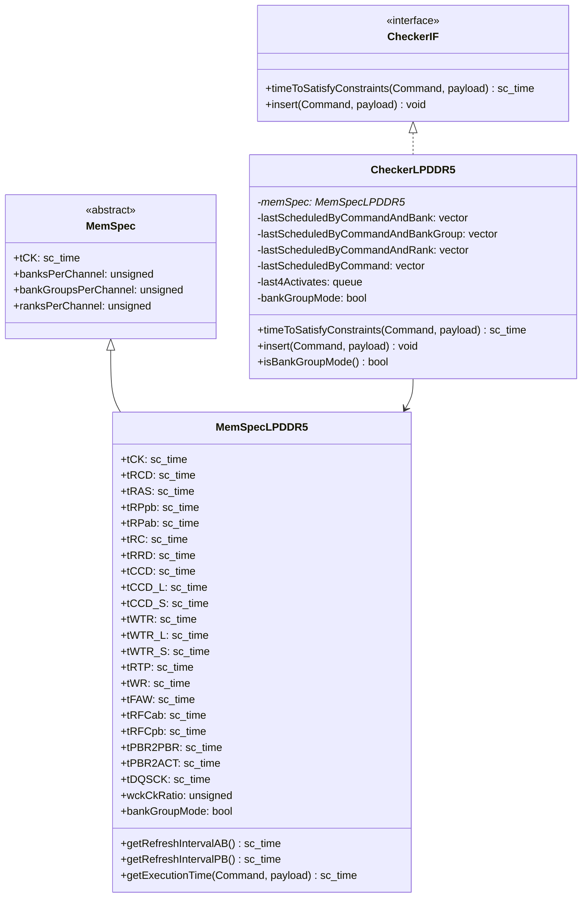

# Design Document: LPDDR5 AC Timing Checker

## Overview

本设计文档描述了LPDDR5 AC Timing Checker的架构和实现方案。该模块负责检查和计算LPDDR5内存命令之间的时序约束，确保发出的命令满足JEDEC LPDDR5规格要求。

设计基于现有的LPDDR4 Checker实现（CheckerLPDDR4），采用相同的接口（CheckerIF）和设计模式，但针对LPDDR5的特性进行了扩展：
- 16个Bank，可配置为8 Bank Group模式（每组2个Bank）或16 Bank模式
- 支持Per-Bank Refresh和All-Bank Refresh两种刷新模式
- 区分tRPpb（单Bank预充电）和tRPab（全Bank预充电）
- 支持BL16和BL32突发长度
- 支持WCK/CK时钟比率（2:1或4:1）
- 新增LPDDR5特有的时序参数（tPBR2PBR, tPBR2ACT等）

## Architecture



## Components and Interfaces

### 1. MemSpecLPDDR5 - LPDDR5内存规格类

继承自MemSpec基类，定义LPDDR5特有的时序参数。

```cpp
class MemSpecLPDDR5 final : public MemSpec
{
public:
    explicit MemSpecLPDDR5(const DRAMSys::Config::MemSpec& memSpec);

    // LPDDR5核心时序参数
    const sc_core::sc_time tCKE;      // Clock Enable时间
    const sc_core::sc_time tRAS;      // Row Active时间
    const sc_core::sc_time tRC;       // Row Cycle时间
    const sc_core::sc_time tRCD;      // Row to Column Delay
    const sc_core::sc_time tRL;       // Read Latency
    const sc_core::sc_time tWL;       // Write Latency
    const sc_core::sc_time tRTP;      // Read to Precharge
    const sc_core::sc_time tWR;       // Write Recovery
    const sc_core::sc_time tWPRE;     // Write Preamble
    const sc_core::sc_time tRPRE;     // Read Preamble
    const sc_core::sc_time tRPST;     // Read Postamble
    const sc_core::sc_time tXP;       // Exit Power Down时间
    const sc_core::sc_time tXSR;      // Exit Self Refresh时间
    const sc_core::sc_time tREFI;     // Refresh Interval
    
    // LPDDR5特有：区分单Bank和全Bank预充电
    const sc_core::sc_time tRPpb;     // Per-Bank Precharge时间
    const sc_core::sc_time tRPab;     // All-Bank Precharge时间
    
    // LPDDR5特有：区分All-Bank和Per-Bank刷新
    const sc_core::sc_time tRFCab;    // All-Bank Refresh Cycle时间
    const sc_core::sc_time tRFCpb;    // Per-Bank Refresh Cycle时间
    const sc_core::sc_time tPBR2PBR;  // Per-Bank Refresh to Per-Bank Refresh
    const sc_core::sc_time tPBR2ACT;  // Per-Bank Refresh to Activate
    
    // Bank/Bank Group相关时序
    const sc_core::sc_time tRRD;      // Row to Row Delay
    const sc_core::sc_time tCCD;      // Column to Column Delay (16 Bank模式)
    const sc_core::sc_time tCCD_L;    // Column to Column Delay Long (8 BG模式)
    const sc_core::sc_time tCCD_S;    // Column to Column Delay Short (8 BG模式)
    const sc_core::sc_time tWTR;      // Write to Read (16 Bank模式)
    const sc_core::sc_time tWTR_L;    // Write to Read Long (8 BG模式)
    const sc_core::sc_time tWTR_S;    // Write to Read Short (8 BG模式)
    const sc_core::sc_time tFAW;      // Four Activate Window
    
    // LPDDR5特有参数
    const sc_core::sc_time tDQSCK;    // DQS to CK delay
    const sc_core::sc_time tDQSS;     // DQS to DQ skew
    const sc_core::sc_time tDQS2DQ;   // DQS to DQ delay
    const sc_core::sc_time tRTRS;     // Rank to Rank Switching
    const sc_core::sc_time tPPD;      // Precharge to Precharge Delay
    
    // 配置参数
    const unsigned wckCkRatio;        // WCK/CK时钟比率 (2或4)
    const bool bankGroupMode;         // 是否启用8 Bank Group模式
    
    // LPDDR5结构参数
    static constexpr unsigned banksPerRank = 16;      // 16个Bank
    static constexpr unsigned bankGroupsPerRank = 8;  // 8 Bank Group模式下
    static constexpr unsigned banksPerBankGroup = 2;  // 每组2个Bank
    
    [[nodiscard]] sc_core::sc_time getRefreshIntervalAB() const override;
    [[nodiscard]] sc_core::sc_time getRefreshIntervalPB() const override;
    [[nodiscard]] sc_core::sc_time
    getExecutionTime(Command command, const tlm::tlm_generic_payload& payload) const override;
    [[nodiscard]] TimeInterval
    getIntervalOnDataStrobe(Command command,
                            const tlm::tlm_generic_payload& payload) const override;
};
```

### 2. CheckerLPDDR5 - LPDDR5时序检查器

实现CheckerIF接口，负责检查和计算命令时序约束。

```cpp
class CheckerLPDDR5 final : public CheckerIF
{
public:
    explicit CheckerLPDDR5(const Configuration& config);
    
    // 计算满足所有约束的最早时间
    [[nodiscard]] sc_core::sc_time
    timeToSatisfyConstraints(Command command,
                             const tlm::tlm_generic_payload& payload) const override;
    
    // 记录已发出的命令
    void insert(Command command, const tlm::tlm_generic_payload& payload) override;
    
    // 查询Bank Group模式
    [[nodiscard]] bool isBankGroupMode() const { return memSpec->bankGroupMode; }

private:
    const MemSpecLPDDR5* memSpec;
    
    // 命令历史记录（按Bank/BankGroup/Rank/全局）
    std::vector<ControllerVector<Bank, sc_core::sc_time>> lastScheduledByCommandAndBank;
    std::vector<ControllerVector<BankGroup, sc_core::sc_time>> lastScheduledByCommandAndBankGroup;
    std::vector<ControllerVector<Rank, sc_core::sc_time>> lastScheduledByCommandAndRank;
    std::vector<sc_core::sc_time> lastScheduledByCommand;
    sc_core::sc_time lastCommandOnBus;
    
    // 突发长度记录（用于BL16/BL32支持）
    ControllerVector<Command, ControllerVector<Bank, uint8_t>> lastBurstLengthByCommandAndBank;
    
    // tFAW窗口跟踪
    ControllerVector<Rank, std::queue<sc_core::sc_time>> last4Activates;
    
    // 预计算的复合时序参数
    sc_core::sc_time tBURST;      // 突发传输时间
    sc_core::sc_time tBURST32;    // BL32突发传输时间
    sc_core::sc_time tRDWR;       // 读到写切换时间
    sc_core::sc_time tRDWR_R;     // 跨Rank读到写切换时间
    sc_core::sc_time tWRRD;       // 写到读切换时间
    sc_core::sc_time tWRRD_R;     // 跨Rank写到读切换时间
    sc_core::sc_time tRDPRE;      // 读到预充电时间
    sc_core::sc_time tWRPRE;      // 写到预充电时间
    
    // 辅助函数
    [[nodiscard]] BankGroup getBankGroup(Bank bank) const;
    [[nodiscard]] bool isSameBankGroup(Bank bank1, Bank bank2) const;
};
```

## Data Models

### 命令类型枚举

使用现有的Command类，支持以下LPDDR5命令：
- ACT: Activate（行激活）
- RD/RDA: Read/Read with Auto-precharge
- WR/WRA: Write/Write with Auto-precharge
- MWR/MWRA: Masked Write/Masked Write with Auto-precharge
- PREPB/PREAB: Precharge Bank/Precharge All Banks
- REFAB: Refresh All Banks
- REFPB: Refresh Per Bank（LPDDR5特有）

### 时序约束矩阵

#### 16 Bank模式

| 前置命令 | 后续命令 | 约束条件 | 时序参数 |
|---------|---------|---------|---------|
| ACT | ACT (同Bank) | 同一Bank | tRC |
| ACT | ACT (不同Bank) | 不同Bank | tRRD |
| ACT | RD/WR | 同一Bank | tRCD |
| ACT | PRE | 同一Bank | tRAS |
| RD | RD | 任意Bank | tCCD |
| RD | WR | 同一Rank | tRDWR |
| RD | PRE | 同一Bank | tRTP |
| WR | WR | 任意Bank | tCCD |
| WR | RD | 同一Rank | tWRRD |
| WR | PRE | 同一Bank | tWRPRE |
| PREPB | ACT | 同一Bank | tRPpb |
| PREAB | ACT | 同一Rank | tRPab |
| REFAB | ACT | 同一Rank | tRFCab |
| REFAB | REFAB | 同一Rank | tRFCab |
| REFPB | ACT (同Bank) | 同一Bank | tRFCpb |
| REFPB | REFPB (同Bank) | 同一Bank | tRFCpb |
| REFPB | REFPB (不同Bank) | 不同Bank | tPBR2PBR |
| 4xACT | ACT | 同一Rank | tFAW |

#### 8 Bank Group模式（额外约束）

| 前置命令 | 后续命令 | 约束条件 | 时序参数 |
|---------|---------|---------|---------|
| RD | RD (同BG) | 同一Bank Group | tCCD_L |
| RD | RD (不同BG) | 不同Bank Group | tCCD_S |
| WR | WR (同BG) | 同一Bank Group | tCCD_L |
| WR | WR (不同BG) | 不同Bank Group | tCCD_S |
| WR | RD (同BG) | 同一Bank Group | tWTR_L |
| WR | RD (不同BG) | 不同Bank Group | tWTR_S |


## Correctness Properties

*A property is a characteristic or behavior that should hold true across all valid executions of a system—essentially, a formal statement about what the system should do. Properties serve as the bridge between human-readable specifications and machine-verifiable correctness guarantees.*

基于需求分析和prework，以下是需要验证的正确性属性：

### Property 1: ACT命令时序约束正确性

*For any* ACT命令和任意Bank组合，timeToSatisfyConstraints返回的时间应满足：
- 同一Bank的ACT间隔 ≥ tRC
- 不同Bank的ACT间隔 ≥ tRRD
- PREPB到ACT间隔 ≥ tRPpb
- PREAB到ACT间隔 ≥ tRPab
- REFAB到ACT间隔 ≥ tRFCab
- REFPB到同一Bank的ACT间隔 ≥ tRFCpb
- 任意4个ACT的时间窗口 ≥ tFAW

**Validates: Requirements 2.1, 2.2, 2.3, 2.4, 2.5, 2.6, 2.7**

### Property 2: RD命令时序约束正确性

*For any* RD命令和任意Bank/BankGroup组合，timeToSatisfyConstraints返回的时间应满足：
- ACT到RD间隔 ≥ tRCD
- 16 Bank模式下RD到RD间隔 ≥ tCCD
- 8 BG模式下同Bank Group的RD间隔 ≥ tCCD_L
- 8 BG模式下不同Bank Group的RD间隔 ≥ tCCD_S
- 16 Bank模式下WR到RD间隔 ≥ tWRRD
- 8 BG模式下同Bank Group的WR到RD间隔 ≥ tWTR_L + tWL + tBURST
- 8 BG模式下不同Bank Group的WR到RD间隔 ≥ tWTR_S + tWL + tBURST

**Validates: Requirements 3.1, 3.2, 3.3, 3.4, 3.5, 3.6, 3.7**

### Property 3: WR命令时序约束正确性

*For any* WR命令和任意Bank/BankGroup组合，timeToSatisfyConstraints返回的时间应满足：
- ACT到WR间隔 ≥ tRCD
- 16 Bank模式下WR到WR间隔 ≥ tCCD
- 8 BG模式下同Bank Group的WR间隔 ≥ tCCD_L
- 8 BG模式下不同Bank Group的WR间隔 ≥ tCCD_S
- RD到WR间隔 ≥ tRDWR

**Validates: Requirements 4.1, 4.2, 4.3, 4.4, 4.5**

### Property 4: PRE命令时序约束正确性

*For any* PRE命令和任意Bank组合，timeToSatisfyConstraints返回的时间应满足：
- ACT到PRE间隔 ≥ tRAS
- RD到PRE间隔 ≥ tRTP
- WR到PRE间隔 ≥ tWRPRE
- PREAB需要所有Bank满足上述约束

**Validates: Requirements 5.1, 5.2, 5.3, 5.4**

### Property 5: REF命令时序约束正确性

*For any* REF命令，timeToSatisfyConstraints返回的时间应满足：
- REFAB需要所有Bank已预充电（PRE到REF间隔 ≥ tRPab）
- 连续REFAB间隔 ≥ tRFCab
- REFPB需要目标Bank已预充电（PRE到REF间隔 ≥ tRPpb）
- 同一Bank连续REFPB间隔 ≥ tRFCpb
- 不同Bank连续REFPB间隔 ≥ tPBR2PBR

**Validates: Requirements 6.1, 6.2, 6.3, 6.4, 6.5, 6.6**

### Property 6: timeToSatisfyConstraints返回最大约束值

*For any* 命令和payload组合，timeToSatisfyConstraints返回的时间应等于所有相关约束中的最大值。

**Validates: Requirements 7.2**

### Property 7: MemSpec参数JSON序列化round-trip

*For any* 有效的MemSpecLPDDR5参数集，序列化到JSON再反序列化应产生等价的参数值。

**Validates: Requirements 1.3**

### Property 8: Bank Group模式时序参数正确应用

*For any* 命令序列，在8 Bank Group模式下应使用tCCD_L/tCCD_S和tWTR_L/tWTR_S参数，在16 Bank模式下应使用tCCD和tWTR参数。

**Validates: Requirements 1.5, 9.1**

### Property 9: 突发长度对时序的影响

*For any* RD/WR命令，BL16和BL32应产生不同的tBURST值，从而影响相关时序约束的计算。

**Validates: Requirements 9.3**

### Property 10: 预充电时序区分

*For any* PRE到ACT的命令序列，PREPB后应使用tRPpb，PREAB后应使用tRPab。

**Validates: Requirements 9.6**

## Error Handling

### 时序违规检测

当命令在约束时间之前发出时，Checker应：
1. 通过SC_REPORT_WARNING报告时序违规
2. 记录违规的具体约束和实际间隔
3. 继续执行（不中断仿真）

### 无效命令处理

当收到未知命令类型时：
1. 通过SC_REPORT_FATAL报告错误
2. 终止仿真

### 配置错误处理

当MemSpec类型不匹配时：
1. 在构造函数中检测
2. 通过SC_REPORT_FATAL报告错误

### Bank Group模式错误处理

当在16 Bank模式下尝试使用Bank Group相关参数时：
1. 忽略Bank Group约束
2. 使用16 Bank模式的通用约束

## Testing Strategy

### 单元测试

使用Google Test框架编写单元测试，覆盖：
1. MemSpecLPDDR5参数加载和默认值
2. 各命令类型的时序约束计算
3. insert函数的状态更新
4. 边界条件和错误处理
5. 16 Bank模式和8 Bank Group模式的切换

### 属性测试

使用RapidCheck（C++ Property-Based Testing库）实现属性测试：
- 每个属性测试运行至少100次迭代
- 生成随机的命令序列和时间戳
- 验证时序约束的正确性
- 分别测试16 Bank模式和8 Bank Group模式

测试标签格式：**Feature: lpddr5-ac-timing-checker, Property N: [property_text]**

### 集成测试

在main.cc中编写测试激励：
1. 生成合法命令序列，验证被正确接受
2. 生成违规命令序列，验证被正确检测
3. 覆盖五类核心命令（RD/WR/ACT/PRE/REF）
4. 分别测试All-Bank Refresh和Per-Bank Refresh

### 测试用例设计

```cpp
// 示例：ACT命令tRC约束测试
void test_act_trc_constraint() {
    // 1. 发出ACT命令到Bank 0
    checker.insert(Command::ACT, payload_bank0);
    
    // 2. 立即查询同一Bank的ACT约束
    sc_time earliest = checker.timeToSatisfyConstraints(Command::ACT, payload_bank0);
    
    // 3. 验证earliest >= current_time + tRC
    EXPECT_GE(earliest, sc_time_stamp() + memSpec->tRC);
}

// 示例：8 Bank Group模式下RD到RD约束测试
void test_rd_tCCD_L_constraint_8bg_mode() {
    // 确保在8 BG模式下
    ASSERT_TRUE(checker.isBankGroupMode());
    
    // 1. 发出RD命令到Bank 0 (Bank Group 0)
    checker.insert(Command::RD, payload_bank0);
    
    // 2. 查询同一Bank Group的Bank 1的RD约束
    sc_time earliest = checker.timeToSatisfyConstraints(Command::RD, payload_bank1);
    
    // 3. 验证使用tCCD_L
    EXPECT_GE(earliest, sc_time_stamp() + memSpec->tCCD_L);
}

// 示例：Per-Bank Refresh约束测试
void test_refpb_tPBR2PBR_constraint() {
    // 1. 发出REFPB命令到Bank 0
    checker.insert(Command::REFPB, payload_bank0);
    
    // 2. 查询不同Bank的REFPB约束
    sc_time earliest = checker.timeToSatisfyConstraints(Command::REFPB, payload_bank1);
    
    // 3. 验证使用tPBR2PBR
    EXPECT_GE(earliest, sc_time_stamp() + memSpec->tPBR2PBR);
}
```

### 测试覆盖矩阵

| 测试类型 | ACT | RD | WR | PRE | REFAB | REFPB |
|---------|-----|----|----|-----|-------|-------|
| 同Bank约束 | tRC | - | - | tRAS | - | tRFCpb |
| 不同Bank约束 | tRRD | tCCD | tCCD | - | - | tPBR2PBR |
| 同BG约束(8BG) | - | tCCD_L | tCCD_L | - | - | - |
| 不同BG约束(8BG) | - | tCCD_S | tCCD_S | - | - | - |
| 跨命令约束 | tRPpb,tRPab,tRFCab,tRFCpb | tRCD,tWTR | tRCD,tRDWR | tRTP,tWR | tRPab,tRFCab | tRPpb,tRFCpb |
| tFAW窗口 | ✓ | - | - | - | - | - |
| BL16/BL32 | - | ✓ | ✓ | - | - | - |

